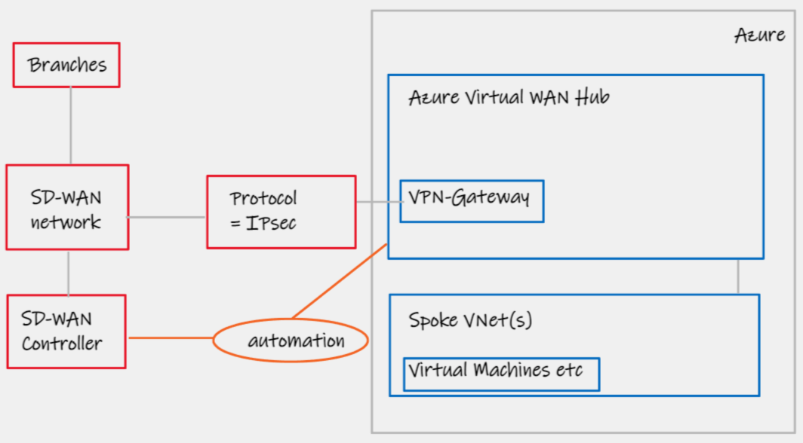
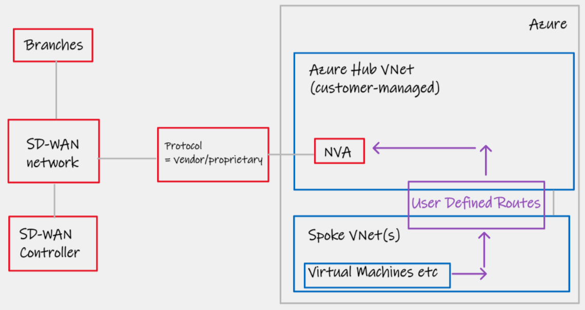
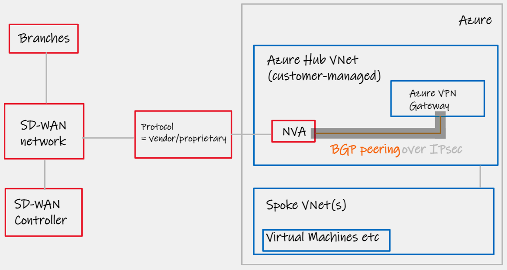
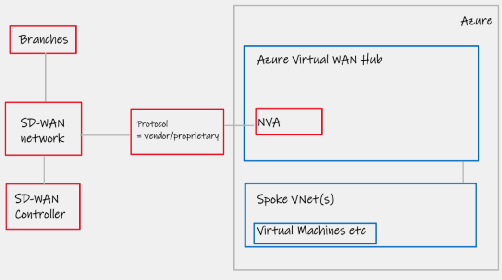
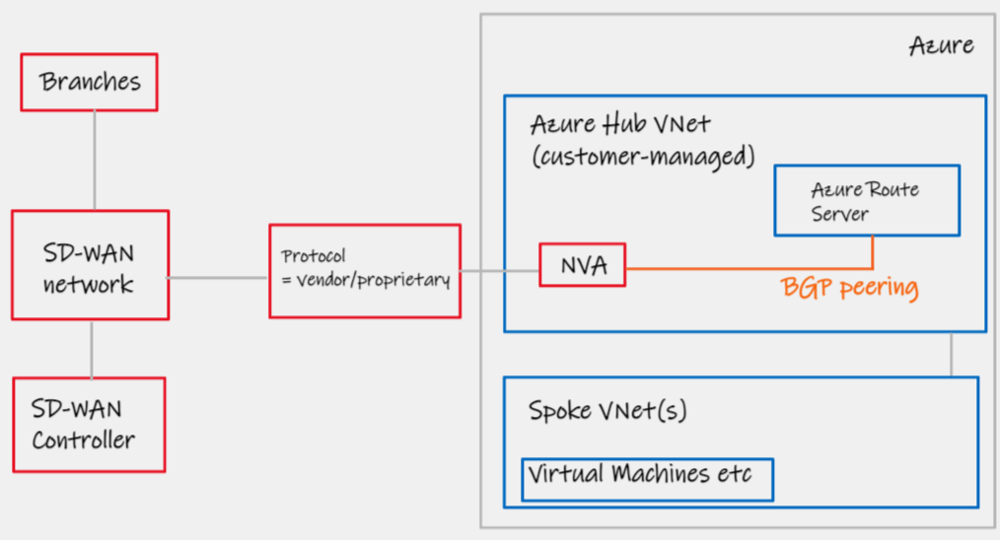
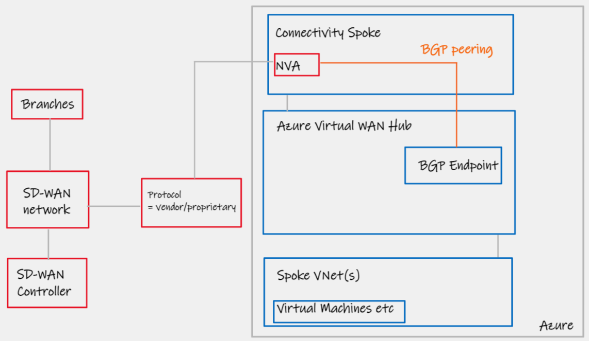
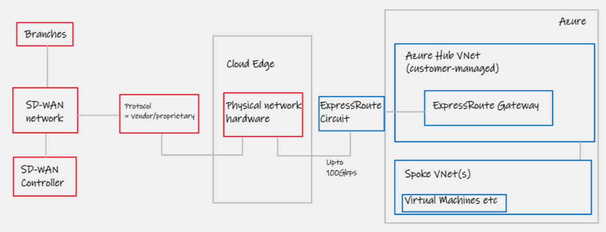
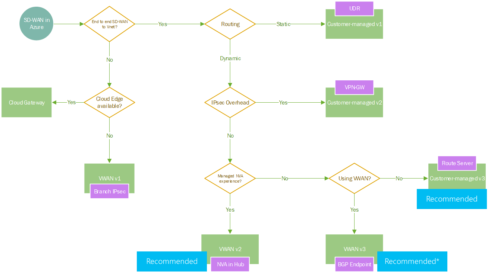

Azure Networking patterns for SD-WAN integration
==============

- [Introduction](#introduction)
- [Option 1 - Virtual WAN v1, IPsec API integration](#option-1---virtual-wan-v1-ipsec-api-integration)
- [Option 2 - Customer managed VNet v1, UDR/Static Routing + NVA](#option-2---customer-managed-vnet-v1-udrstatic-routing--nva)
- [Option 3 - Customer managed VNet v2, BGP-over-IPsec with VPN Gateway + NVA](#option-3---customer-managed-vnet-v2-bgp-over-ipsec-with-vpn-gateway--nva)
- [Option 4 - Virtual WAN v2, "NVA in the Hub"](#option-4---virtual-wan-v2-nva-in-the-hub)
- [Option 5 - Customer managed VNet v3, Azure Route Server + NVA](#option-5---customer-managed-vnet-v3-azure-route-server--nva)
- [Option 6 - Virtual WAN v3, BGP Endpoint + NVA](#option-6---virtual-wan-v3-bgp-endpoint--nva)
- [Option 7 - Cloud Edge Colocation, Physical appliance](#option-7---cloud-edge-colocation-physical-appliance)
- [Conclusion and options flow-chart](#conclusion-and-options-flow-chart)

# Introduction

> This article compliments a two part video series published on YoutTube. Part 1 [here](https://youtu.be/a9Z5FuV7yJE) covers the strategy angle and "asking the right questions", whilst Part 2 [here](https://youtu.be/DRYSkxOjetU) is the video couterpart to this article, focused on the technical integration patterns for SD-WAN integration in to Azure Virtual Networking

We will jump straight in to the technical scenarios/options. For preamble and context, please watch the videos linked above. NB. You can also click the section headers, to take you straight to video content for that particular topic.

> :warning: Check with your networking vendor for approved/reference designs before continuing

# [Option 1 - Virtual WAN v1, IPsec API integration](https://www.youtube.com/watch?v=DRYSkxOjetU&t=661s)

## Summary of design option

This design pattern has existed since 2018 when Azure Virtual WAN first went Generally Available. It utilises automation between the networking vendors SD-WAN controller and API's exposed by the Azure Virtual WAN Hub. These APIs offer programmatic automation for attachment of the SD-WAN to Cloud. Example, a new site comes online in Chicago, it is tagged as "cloud enabled" in the SD-WAN vendors software. IPsec tunnels are automatically built from the Branch CPE to Azure Virtual WAN.--

## Design characteristics

| Design area  | Details |
| ------------- | ------------- |
| Network Transport | IPsec only  |
| Azure Networking category  | Azure Virtual WAN  |
| Azure/Cloud CPE device  | Azure Virtual WAN VPN Gateway |
| Routing | Dynamic |
| Notes | 1000 sites, 2Gbps per site, 20Gbps aggregate [^1] |

[^1]: https://docs.microsoft.com/en-us/azure/azure-resource-manager/management/azure-subscription-service-limits#virtual-wan-limits

### Links

- Microsoft Azure Virtual WAN landing page for supported partners - https://docs.microsoft.com/en-us/azure/virtual-wan/virtual-wan-locations-partners#partners
- Example of vendor pattern utilising this topology, Meraki - https://documentation.meraki.com/MX/Deployment_Guides/Cisco_Meraki_MX_Branch_to_Azure_Virtual_WAN_Deployment_Guide

# [Option 2 - Customer managed VNet v1, UDR/Static Routing + NVA](https://www.youtube.com/watch?v=DRYSkxOjetU&t=805s)

## Summary of design option

This design pattern has existed for nearly as long as Azure Virtual Networks have. The ability to insert Network Virtual Appliances (NVAs) is a common function leveraged by customers to insert 3rd party Firewalls in the middle of network flows between endpoints inside or to/from the Cloud. We are able to use this same pattern with SD-WAN virtual appliances.

## Design characteristics

| Design area  | Details |
| ------------- | ------------- |
| Network Transport | SD-WAN  |
| Azure Networking category  | Virtual Network (customer managed) |
| Azure/Cloud CPE device  | Vendor NVA |
| Routing | Static |
| Notes | Not only will you required static UDR on Spoke Virtual Networks to point SD-WAN bound traffic at your SD-WAN NVA, the SD-WAN appliance itself will have to internally originate static routes that represent your Azure address space. Consider your HA pattern, will you use Azure Load Balancer Active/Active or UDR Rewrite Active/Standby; this will largely be determined by any advanced stateful security features you may be packaging as part of your SD-WAN deployment. |

[^1]: https://docs.microsoft.com/en-us/azure/azure-resource-manager/management/azure-subscription-service-limits#virtual-wan-limits

### Links

- Microsoft documentation for generic high availability patterns for NVAs - https://docs.microsoft.com/en-us/azure/architecture/reference-architectures/dmz/nva-ha

# [Option 3 - Customer managed VNet v2, BGP-over-IPsec with VPN Gateway + NVA](https://www.youtube.com/watch?v=DRYSkxOjetU&t=900s)

## Summary of design option

This design pattern looked to enhance #2 with a workaround (trick!) related to Azure VPN Gateways. Historically, VPN Gateways were the only endpoint you were able to configured custom BGP peerings to. By establishing IPsec tunnels between the NVA in the Cloud, and the Azure VPN in the Cloud (now possible using [private IPs](https://docs.microsoft.com/en-us/azure/vpn-gateway/media/site-to-site-vpn-private-peering/gateway.png)), we were able to dynamically exchange routes. I.e. the VPN Gateway was purely a bump in the wire, to take BGP information from your NVA, and use it's natively ability to inject routes in to the Azure SDN.

## Design characteristics

| Design area  | Details |
| ------------- | ------------- |
| Network Transport | SD-WAN |
| Azure Networking category  | Virtual Network (customer managed)  |
| Azure/Cloud CPE device  | Vendor NVA|
| Routing | Dynamic |
| Notes | Check vendor supports eBGP multi-hop. Maximum 4 IPsec tunnels, offering approximately 1.25Gbps *4 = 5Gbps throughput aggregate. [^2] |

[^2]: https://docs.microsoft.com/en-us/azure/vpn-gateway/vpn-gateway-about-vpngateways#benchmark

# [Option 4 - Virtual WAN v2, "NVA in the Hub"](https://www.youtube.com/watch?v=DRYSkxOjetU&t=966s)

## Summary of design option

This design pattern has existed since mid 2020. In addition to the APIs exposed within Azure Virtual WAN as part of pattern #1, additional, deeper, integrations were opened up for networking partners. In this model, after collaboratively working with Microsoft on the required integration, network vendors are able to place their native virtual appliances directly inside of the Virtual WAN Hub. These appliances then appear as any other Virtual WAN component; that is, entirely managed, with no need to worry about the actual resource, resilience, scaling, feeding and watering etc. In my opinion this offers the deepest levels of Azure integration, it is effectively a PaaS service for SD-WAN endpoint in the Cloud. This integration, also grants the NVA special access to the SDN in order ot dynamically exchange routes as if it were a native service.

## Design characteristics

| Design area  | Details |
| ------------- | ------------- |
| Network Transport | SD-WAN |
| Azure Networking category  | Azure Virtual WAN  |
| Azure/Cloud CPE device  | Managed (PaaS) vendor NVA|
| Routing | Dynamic |
| Notes | Limited vendor support, see below link|

[^1]: https://docs.microsoft.com/en-us/azure/azure-resource-manager/management/azure-subscription-service-limits#virtual-wan-limits

### Links

- Microsoft Azure Virtual WAN landing page for supported partners - https://docs.microsoft.com/en-us/azure/virtual-wan/virtual-wan-locations-partners#integrated-virtual-hub-nva-partners

# [Option 5 - Customer managed VNet v3, Azure Route Server + NVA](https://www.youtube.com/watch?v=DRYSkxOjetU&t=1117s)

## Summary of design option

Azure Route Server (ARS) went GA in September 2021. This pattern effectively supersedes pattern #3; now that we can talk BGP directly to ARS, there is no need to deal with the overhead/technical-hassle of running this routing protocol over IPsec. ARS acts as a route reflector, allowing the VNets (local and peered) to learn of your SD-WAN routes, and vice-versa. Note "route reflector", ARS does not sit in the data-path by design.

## Design characteristics

| Design area  | Details |
| ------------- | ------------- |
| Network Transport | SD-WAN |
| Azure Networking category  | Virtual Network (customer managed)  |
| Azure/Cloud CPE device  | vendor NVA |
| Routing | Dynamic |
| Notes | Pay attention to ARS limits, approach summarization with care, especially in migration scenarios [^3] |

[^3]: Whilst a maximum of 1000 routes per NVA BGP peer can be advertised _to_ Azure Route Server, note that if using the branch2branch feature of ARS, this limit effectively drops to 200 **total routes across all BGP peers** https://docs.microsoft.com/en-us/azure/route-server/route-server-faq#route-server-limits

### Links

- Microsoft Azure Route Server documentation - https://docs.microsoft.com/en-us/azure/route-server/overview#how-does-it-work

# [Option 6 - Virtual WAN v3, BGP Endpoint + NVA](https://www.youtube.com/watch?v=DRYSkxOjetU&t=1239s)

## Summary of design option

**The BGP Endpoint feature is still in public prefix as of March 2022**

If you are using Azure Virtual WAN and your favorite networking vendor is not available for pattern #4 then this might be the topology for you. Similar to Azure Route Server, BGP Endpoint for Virtual WAN exposes the ability to directly BGP peer. We are then able to place our NVA in an attached Virtual Network Spoke, and establish BGP Peering sessions with the hub over private IPs (over VNet peering).

## Design characteristics

| Design area  | Details |
| ------------- | ------------- |
| Network Transport | SD-WAN  |
| Azure Networking category  | Azure Virtual WAN  |
| Azure/Cloud CPE device  | vendor NVA |
| Routing | Dynamic |
| Notes | Public preview |

[^1]: https://docs.microsoft.com/en-us/azure/azure-resource-manager/management/azure-subscription-service-limits#virtual-wan-limits

### Links

- Microsoft Azure Virtual WAN BGP endpoint preview page - https://docs.microsoft.com/en-us/azure/virtual-wan/create-bgp-peering-hub-portal

# [Option 7 - Cloud Edge Colocation, Physical appliance](https://www.youtube.com/watch?v=DRYSkxOjetU&t=1295s)

## Summary of design option

An alternative approach. Instead of stretching our SD-WAN solution all the way in to Azure, and in to our Virtual Networks that ride upon the Azure SDN, we may decide to only stretch our SD-WAN network as far as our cloud edge PoPs. This is for those customers who have racks located within collocation centres that are strategically placed in close proximity to major cloud vendors. In this model, the SD-WAN does it's job in getting your business network over the public Internet, and the "last cloud mile" is handled by traditional technologies, normally ExpressRoute. This is a great choice if you have either large (>10Gbps) throughput requirements, or extremely complicated multi-vrf networks, wherein the physical SD-WAN appliances can be sized and specified appropriately. 

## Design characteristics

| Design area  | Details |
| ------------- | ------------- |
| Network Transport | SD-WAN to Cloud Edge, ExpressRoute to Azure |
| Azure Networking category  | n/a  |
| Azure/Cloud CPE device  | n/a|
| Routing | Dynamic |
| Notes | You can solve for the "cloud edge" box in a number of ways; a) Build it yourself, common with large Enterprise, b) Take a Virtual Edge from a company like Equinix or c) Take a Cloud Onramp service as part of your SD-WAN vendor offering. See links below.  |

[^1]: https://docs.microsoft.com/en-us/azure/azure-resource-manager/management/azure-subscription-service-limits#virtual-wan-limits

### Links

- Microsoft Azure Virtual WAN landing page for supported partners - https://docs.microsoft.com/en-us/azure/virtual-wan/virtual-wan-locations-partners#partners
- VMware (VeloCloud) managed SD-WAN Gateways - https://sase.vmware.com/products/component-gateways

# [Conclusion and options flow-chart](https://www.youtube.com/watch?v=DRYSkxOjetU&t=1412s)

The number of technical options may feel confusing or overwhelming, but I would keep things simple;

- If you are using customer-managed traditional hub/spoke networking, aim for pattern #5 based on Azure Route Server
- If you are using Azure Virtual WAN based networking, aim for pattern #4 "NVA in hub", otherwise pattern #6 with "BGP Endpoint".

The non tl;dr version of this is represented in the flow-chart below.

